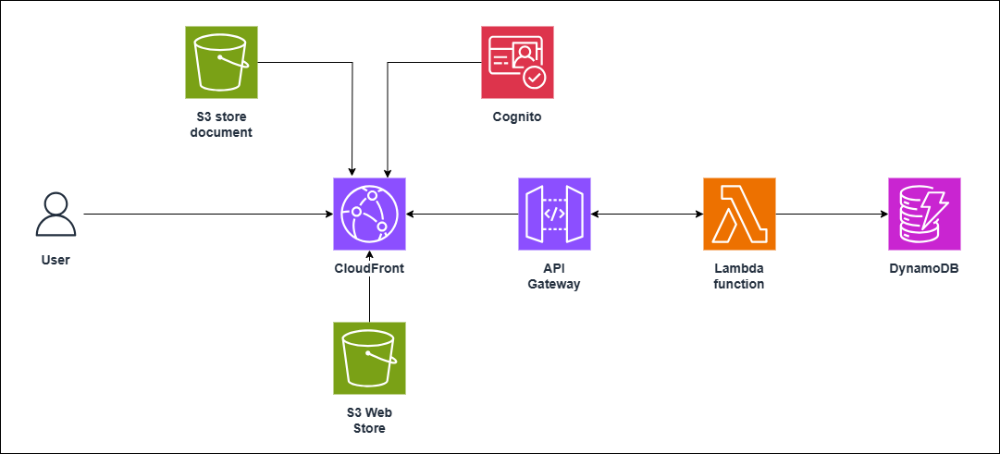

# S3 Upload Feature Demo

A comprehensive cloud-native document management system demonstrating secure S3 file uploads with role-based access control. This project showcases modern serverless architecture patterns using AWS services, featuring a TypeScript-based backend API and a React frontend with AWS Cloudscape Design System.



## 🏗️ Project Structure

```
S3-Upload-Feature-Demo/
├── docs-api/           # Backend API (HonoJS + TypeScript)
├── docs-ui/            # Frontend React Application
├── docs-infra/         # Terraform Infrastructure as Code
└── image/              # Architecture diagrams
```

## 🚀 System Architecture

### Core Components

**1. Backend API (`docs-api`)**

- **Framework**: HonoJS - Ultra-fast, lightweight web framework
- **Runtime**: Node.js with TypeScript
- **Storage**: AWS S3 with presigned URLs for secure uploads
- **Database**: DynamoDB for document metadata
- **Authentication**: Role-based access control (Admin/Vendor)
- **Deployment**: AWS Lambda with API Gateway

**2. Frontend UI (`docs-ui`)**

- **Framework**: React 19 with TypeScript
- **UI Library**: AWS Cloudscape Design System
- **State Management**: TanStack React Query
- **Routing**: React Router v7
- **Authentication**: AWS Amplify integration
- **Features**: Tree-view document navigation, drag-and-drop uploads

**3. Infrastructure (`docs-infra`)**

- **IaC Tool**: Terraform
- **Modules**: S3, DynamoDB, Lambda, API Gateway, Cognito, IAM
- **Environment**: Configurable multi-environment setup

## ☁️ AWS Infrastructure

### Architecture Components

**Authentication & Authorization**

- **Amazon Cognito**: User pool management and JWT token authentication
- **IAM Roles**: Fine-grained permissions for different user roles
- **Role-Based Access Control**: Admin and Vendor role separation

**Storage & Database**

- **Amazon S3**:
  - Document storage with vendor-based folder structure
  - Presigned URLs for secure, time-limited access
  - CloudFront integration for global content delivery
- **DynamoDB**:
  - Document metadata and user permissions
  - Scalable NoSQL database with on-demand pricing
  - Efficient query patterns for document operations

**Compute & API**

- **AWS Lambda**: Serverless function execution
- **API Gateway**: RESTful API management and routing
- **CloudFront**: Content delivery network for static assets

**Security & Monitoring**

- **AWS KMS**: Encryption key management
- **CloudWatch**: Logging and monitoring
- **SSL/TLS**: End-to-end encryption

### Document Access Flow

1. **Authentication**: User authenticates via Cognito
2. **Authorization**: JWT token validates user permissions
3. **Upload Request**: Frontend requests presigned URL from API
4. **Direct Upload**: File uploads directly to S3 (bypassing server)
5. **Metadata Storage**: Document information stored in DynamoDB
6. **Access Control**: Role-based permissions enforced on all operations

## ✨ Key Features

### 🗂️ Vendor-Based Organization

- **Isolated Storage**: Each vendor has dedicated S3 folder structure
- **Secure Access**: Role-based permissions prevent cross-vendor access
- **Hierarchical Navigation**: Tree-view interface for intuitive browsing

### � Role-Based Access Control

**Admin Role:**

- Full access to all vendor documents
- Complete CRUD operations across the system
- User and vendor management capabilities
- System-wide analytics and reporting

**Vendor Role:**

- Access limited to own folder structure
- Upload, download, and manage own documents only
- Cannot view or access other vendors' data
- Streamlined vendor-specific interface

### 📁 Document Management

- **Drag & Drop Upload**: Modern file upload experience
- **Progress Tracking**: Real-time upload progress indicators
- **File Preview**: In-browser preview for supported formats
- **Bulk Operations**: Multiple file selection and operations
- **Search & Filter**: Advanced document discovery features

### 🔒 Security Features

- **Presigned URLs**: Time-limited, secure S3 access
- **JWT Authentication**: Stateless token-based security
- **CORS Protection**: Cross-origin request security
- **Encryption**: Data encrypted in transit and at rest

## 💰 AWS Cost Analysis

**Singapore Region (ap-southeast-1) - 1000 Users/Month**

### Usage Assumptions

| Metric | Value | Description |
|--------|-------|-------------|
| Users | 1,000 | Active monthly users |
| Files per user | 50/month | Document uploads per user |
| Average file size | 2MB | Mixed document types |
| API calls | 5M/month | All CRUD operations |
| Data transfer | 500GB/month | Downloads and previews |

### Monthly Cost Breakdown

| Service | Usage | Monthly Cost |
|---------|-------|-------------|
| **S3 Storage** | 102GB storage + requests | $3.25 |
| **CloudFront CDN** | 500GB transfer + 10M requests | $67.50 |
| **API Gateway** | 5M API calls + 50GB transfer | $9.50 |
| **Lambda** | 5M requests + compute time | $3.78 |
| **DynamoDB** | 1.5M requests + 1GB storage | $1.13 |
| **Cognito** | 950 active users | $5.23 |
| **Total Monthly Cost** | | **$90.39** |

*Cost estimates based on AWS pricing in Singapore region as of 2025*

## 🛠️ Technology Stack

### Backend (docs-api)

```typescript
Framework: HonoJS v4.0+ (Ultra-fast web framework)
Runtime: Node.js with TypeScript
AWS SDK: v3.500+ (S3, DynamoDB, Lambda)
Dependencies:
  - @hono/node-server: HTTP server adapter
  - @aws-sdk/s3-request-presigner: Secure URL generation
  - uuid: Unique identifier generation
```

### Frontend (docs-ui)

```typescript
Framework: React 19 with TypeScript
UI Library: AWS Cloudscape Design System v3.0+
State Management: TanStack React Query v5.80+
Routing: React Router v7.6+
Authentication: AWS Amplify v6.15+
HTTP Client: Axios
Utilities: filesize, uuid
```

### Infrastructure (docs-infra)

```hcl
IaC: Terraform v1.0+
Provider: AWS Provider v6.11+
Modules: S3, DynamoDB, Lambda, API Gateway, Cognito, IAM
Archive: terraform-archive v2.4+
Environment: Multi-environment support
```

## 📋 Prerequisites

Before getting started, ensure you have:

- **Node.js**: v16 or later
- **AWS CLI**: Configured with appropriate permissions
- **Terraform**: v1.0+ for infrastructure deployment
- **Package Manager**: npm or yarn
- **AWS Account**: With sufficient permissions for S3, Lambda, DynamoDB, etc.

## 🚀 Quick Start

### 1. Infrastructure Deployment

```bash
# Navigate to infrastructure directory
cd docs-infra

# Initialize Terraform
terraform init

# Review and customize terraform.tfvars
cp terraform.tfvars.example terraform.tfvars

# Plan deployment
terraform plan

# Deploy infrastructure
terraform apply
```

### 2. Backend API Setup

```bash
# Navigate to API directory
cd docs-api

# Install dependencies
npm install

# Configure environment variables
cp .env.example .env
# Edit .env with your AWS resource names

# Start development server
npm run dev
```

### 3. Frontend UI Setup

```bash
# Navigate to UI directory
cd docs-ui

# Install dependencies
npm install

# Configure environment variables
cp .env.example .env
# Edit .env with API endpoint

# Start development server
npm start
```

## 📚 API Documentation

### Authentication Endpoints

| Endpoint | Method | Description |
|----------|--------|-------------|
| `/health` | GET | Health check endpoint |
| `/api/auth/validate` | POST | Validate JWT token |

### Document Management

| Endpoint | Method | Description |
|----------|--------|-------------|
| `/api/documents` | GET | List user documents |
| `/api/documents/presigned-url` | POST | Generate upload URL |
| `/api/documents` | POST | Create document metadata |
| `/api/documents/:id` | GET | Get document details |
| `/api/documents/:id/download` | GET | Get download URL |
| `/api/documents/:id` | DELETE | Delete document |

### Vendor Management (Admin Only)

| Endpoint | Method | Description |
|----------|--------|-------------|
| `/api/vendors` | GET | List all vendors |
| `/api/vendors/:id/documents` | GET | List vendor documents |
| `/api/roles` | GET | Get user role information |

## 🚢 Deployment

### Production Deployment Steps

1. **Infrastructure First**

   ```bash
   cd docs-infra
   terraform apply -var="environment=production"
   ```

2. **Build and Deploy API**

   ```bash
   cd docs-api
   npm run build:lambda
   npm run package:lambda
   # Deploy lambda-deployment.zip through AWS Console or CLI
   ```

3. **Build and Deploy UI**

   ```bash
   cd docs-ui
   npm run build
   # Deploy build/ directory to S3 static hosting or CloudFront
   ```

### Environment Configuration

```bash
# docs-api/.env.production
AWS_REGION=us-east-1
DOCUMENTS_TABLE_NAME=production-documents
DOCUMENT_STORE_BUCKET_NAME=production-docs-bucket
NODE_ENV=production
ALLOWED_ORIGINS=https://yourdomain.com

# docs-ui/.env.production
REACT_APP_API_URL=https://api.yourdomain.com
REACT_APP_ENV=production
```

## 🔧 Development Commands

```bash
# Root level commands
npm run install:all      # Install all dependencies
npm run dev:all         # Start all services in development
npm run build:all       # Build all projects
npm run test:all        # Run all tests

# Individual project commands
cd docs-api && npm run dev        # Start API server
cd docs-ui && npm start          # Start UI development server
cd docs-infra && terraform plan  # Plan infrastructure changes
```

## 🐛 Troubleshooting

### Common Issues

**API Connection Errors**

- ✅ Verify API server is running on correct port
- ✅ Check CORS configuration in API environment
- ✅ Validate frontend API URL configuration

**S3 Upload Failures**

- ✅ Confirm S3 bucket exists and is accessible
- ✅ Check AWS credentials and IAM permissions
- ✅ Verify presigned URL hasn't expired (default: 1 hour)

**Authentication Issues**

- ✅ Validate Cognito user pool configuration
- ✅ Check JWT token expiration
- ✅ Verify user role assignments in DynamoDB

**Permission Denied Errors**

- ✅ Review IAM policies for required permissions
- ✅ Check S3 bucket policies
- ✅ Validate user role-based access controls

**Infrastructure Deployment Issues**

- ✅ Ensure Terraform state is properly managed
- ✅ Verify AWS provider credentials
- ✅ Check for naming conflicts in resource names

### Logging and Monitoring

- **CloudWatch Logs**: Monitor Lambda function execution
- **API Gateway Logs**: Track request/response patterns
- **S3 Access Logs**: Monitor bucket access patterns
- **DynamoDB Metrics**: Track read/write capacity usage

## 🤝 Contributing

1. Fork the repository
2. Create a feature branch: `git checkout -b feature/amazing-feature`
3. Commit changes: `git commit -m 'Add amazing feature'`
4. Push to branch: `git push origin feature/amazing-feature`
5. Open a Pull Request

## 📄 License

This project is licensed under the MIT License - see the [LICENSE](LICENSE) file for details.

## 🙏 Acknowledgments

- [HonoJS](https://hono.dev/) - Ultra-fast web framework
- [AWS Cloudscape](https://cloudscape.design/) - Design system
- [React Query](https://tanstack.com/query) - Data fetching library
- [Terraform](https://terraform.io/) - Infrastructure as Code
